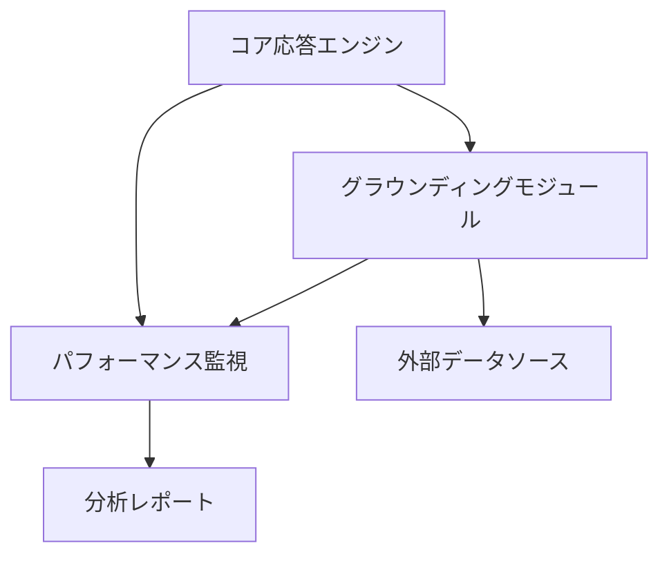

# システムアーキテクチャ

## 基本構造
- langgraphをベースとしたモジュラー設計
- コアモジュールとプラグイン形式の拡張機能

## 主要コンポーネント
1. コア応答エンジン
   - 基本的なAI応答処理
   - プロンプト管理
   - コンテキスト制御

2. グラウンディングモジュール
   - 外部データとの連携
   - 情報検証システム
   - コンテキスト拡張機能

3. パフォーマンス監視（langsmith）
   - モデル性能の追跡
   - 応答品質の評価
   - 改善点の特定

## 設計パターン
- モジュラーアーキテクチャ
- プラグインシステム
- イベント駆動型処理

## コンポーネント間の関係

## 技術的決定事項
- Python環境での開発
- langgraphによる処理フロー制御
- langchainによる機能拡張
- langsmithによるモニタリング
