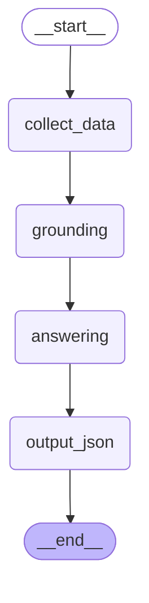

```mermaid
%%{init: {'flowchart': {'curve': 'linear'}}}%%
graph TD;
	__start__([<p>__start__</p>]):::first
	collect_data(collect_data)
	grounding(grounding)
	answering(answering)
	output_json(output_json)
	__end__([<p>__end__</p>]):::last
	__start__ --> collect_data;
	answering --> output_json;
	collect_data --> grounding;
	grounding --> answering;
	output_json --> __end__;
	classDef default fill:#f2f0ff,line-height:1.2
	classDef first fill-opacity:0
	classDef last fill:#bfb6fc

```